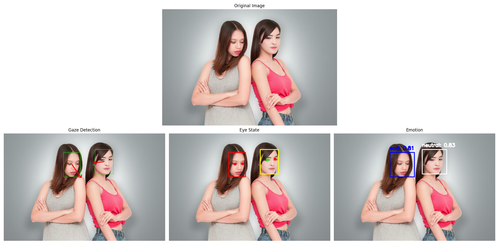
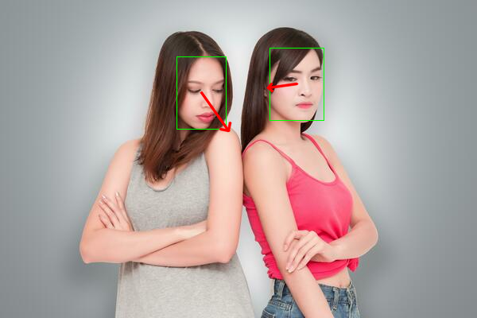
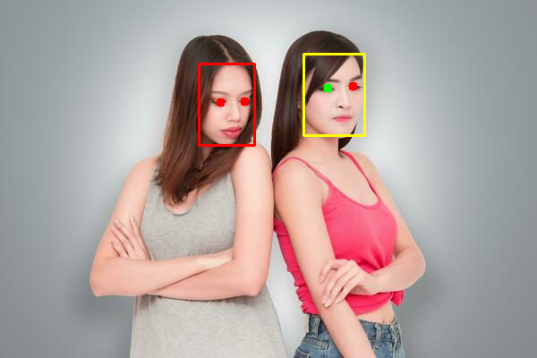
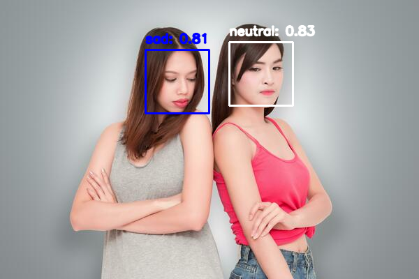

# Face Analysis

A package for analyzing faces in images to detect eye state, gaze direction, and facial expressions.

|   |   |
|-------------|--------------|
|  |
|   |   |

## Features

- **Gaze Detection**: Determine gaze direction using ResNet models
- **Eye State Classification**: Detect whether eyes are open or closed
- **Emotion Recognition**: Identify facial expressions and emotions


## How to install:

1. Create a virtual environment:

```sh
python3 -m venv venv
source venv/bin/activate
```

2. Install dependencies:

```sh
bash install.sh
```
**Note: This script will download the following resources:**

   - The shape predictor from [dlib files](https://dlib.net/files/)
   - The L2CSNet weights found at [L2CSNet repository](https://github.com/Ahmednull/L2CS-Net.git)

**After downloading these resources, the script will proceed to install the `face_analysis` package.**

## Usage Examples

### Gaze Detection

```python
from face_analysis.gazes import Pipeline as GazesPipeline
from face_analysis.gazes import render as GazesRender

gaze_pipeline = GazesPipeline(
    weights="models/L2CSNet_gaze360.pkl",
    arch='ResNet50',  # Options: "ResNet18", "ResNet34", "ResNet101", "ResNet152"
    detector="retinaface",  # Options: "mtcnn"
    device="cuda",  # or "cpu"
)

img_in = cv2.imread("input/test.jpg")
results = gaze_pipeline.step(img_in)
img_out = GazesRender(img_in, results)
```

|   |   |
|-------------|--------------|
|  |  |
|   |   |

### Eye State Detection

```python
from face_analysis.eyes import Pipeline as EyesPipeline
from face_analysis.eyes import render as eyes_render

eye_pipeline = EyesPipeline(
    weights=config.EYE_STATE_MODEL_WEIGHTS,
    shape_predictor=config.SHAPE_PREDICTOR,
    detector="retinaface", # or "dlib"
    device="cuda", # or "cpu"
)

img_in = cv2.imread(img_path)
results = eye_pipeline.step(img_in)
img_out = eyes_render(img_in, results)
```

|   |   |
|-------------|--------------|
|  |  |
|   |   |

### Emotion Detection

```python
from face_analysis.emotions import Pipeline as EmotionsPipeline
from face_analysis.emotions import render as emotions_render

emotion_pipeline = EmotionsPipeline(
    detector= "retinaface", # or "mtcnn", or "cascade"
    device= "cpu",
)

img_in = cv2.imread(img_path)
results = emotion_pipeline.step(img_in)
img_out = emotions_render(img_in, results)
```

|   |   |
|-------------|--------------|
|  |  |
|   |   |


## Command Line Interface

- Analyze single image:

```sh
python -m face_analysis.run_face_analysis --images input/test.jpg --output output
```

- Analyze multiple images:

```sh
python -m face_analysis.run_face_analysis \
    --images input/test_1.png input/test_2.jpg  \
    --output output \
    --save-annotated-images
```

**Options:**

   `--device cuda` to use GPU (default: cpu)

   `--save-annotated-images` to save visualization images

The input/output results for this run can be found [here](./output/).


## Quick Start Example

For interactive examples, see the [notebook](./notebooks/notebook.ipynb)

## Repo Structure

```sh
project_root/
├── data/               
├── input/
│   ├── test_1.jpg
│   └── test_2.jpg          
├── output/             
│   ├── annotated/ 
│   │   ├── test_1_emotions.png
│   │   ├── test_1_eyes.png
│   │   └── ...
│   └── face_analysis_results.json
│
├── scripts/               
│   ├── datasets/
│   ├── face_analyzer.sh
│   └── ...
│
├── src/                    
│   └── face_analysis/
│
├── models/          
│   ├── L2CSNet_gaze360.pkl
│   ├── eye_state_classifier.h5
│   └── shape_predictor_68_face_landmarks.dat
├── LICENSE.txt
├── MANIFEST.in
├── pyproject.toml
├── README.md
├── requirements.txt
└── results.json
```