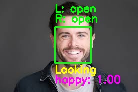
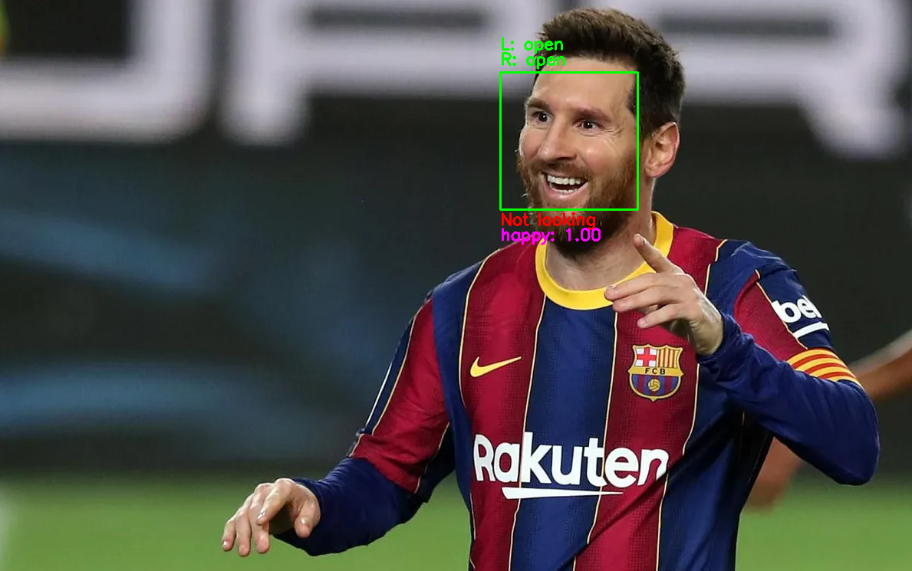
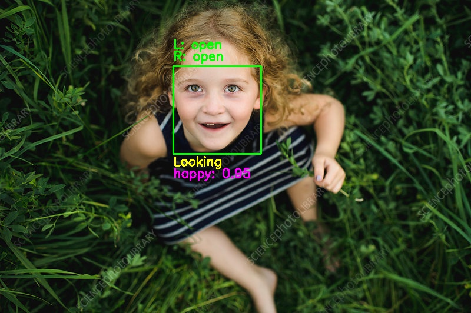
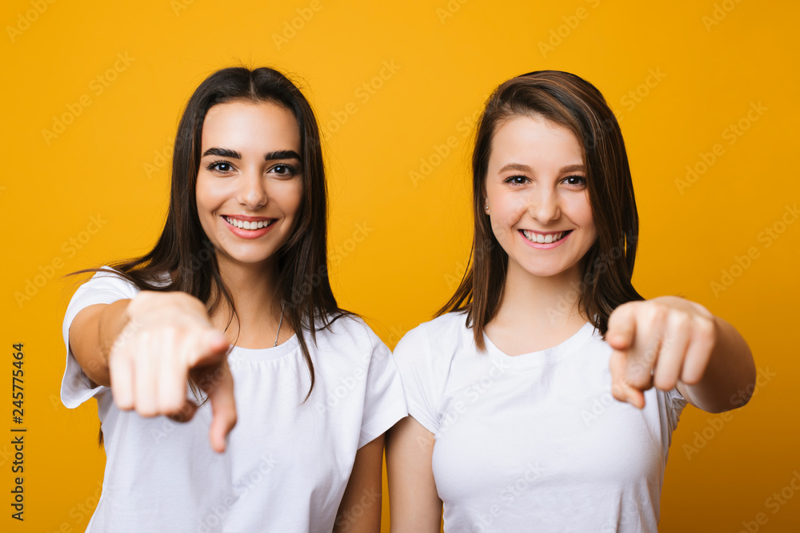
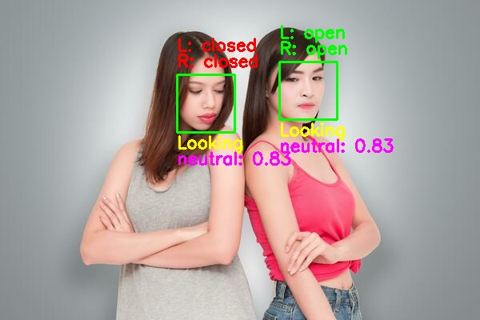
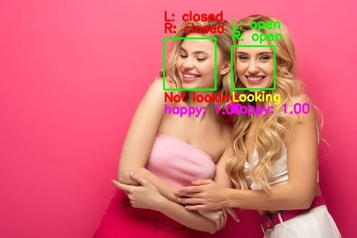
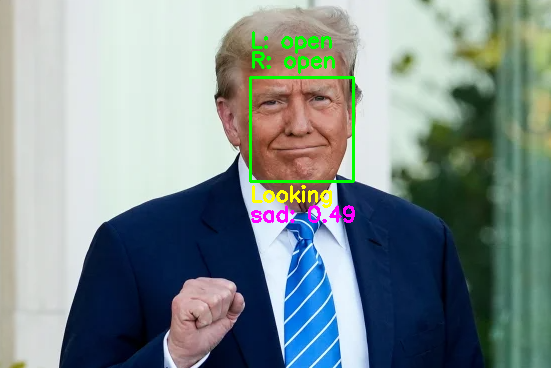

# Face Analysis

A tool for analyzing faces in images to detect eye state, gaze direction, and facial expressions

## How to install:

- Create a virtual environment:

```sh
python3 -m venv venv
source venv/bin/activate  # On Windows: venv\Scripts\activate
```

- Install dependencies:

```sh
pip install -r requirements.txt
```

- Download Shape Predictor:

```sh
bash scripts/shape_predictor.sh
```

## How to run the script:

- Place your images in the `input/` folder.
- Run the script with these options:

```sh
python3 src/main.py [-h] --input INPUT [--debug]
```

### Process a folder of images:

```sh
python3 src/main.py --input input/
```

### Process a single image:

```sh
python3 src/main.py --input input/test_1.jpg --debug
```
_debug mode enables step-by-step visualization of the emotion/gaze detection process_

### Demo App:

The project includes a graphical demo application for interactively analyzing images:

```sh
python3 src/app.py
```

The demo app provides:

- Side-by-side view of original and annotated images
- Option to select any image from your file system
- Ability to download the analysis results as a JSON file
- Visual representation of face features, eye state, and gaze direction

## Output

The script generates two JSON files in the results directory:

1. `predictions.json` - Contains detailed analysis of all faces
2. `image_selection.json` - Contains simplified results with only:
   - Whether eyes are open
   - Whether subject is looking at camera
   - Smiling score (0-1)

Example simplified output:

```json
{
  "test-1.jpg": {
    "face_0": {
      "eyes_open": true,
      "looking_at_camera": true,
      "smiling_score": 1.0
    }
  }
}
```

Annotated images are saved to the `output/images/` directory when using debug mode.

## Example Usages  

| Input | Output |
|-------|--------|
|  |  |
|  |  |
|  |  |
|  |  |
|  |  |
|  |  |
|  |  |
|  |  |

## Repo Structure

```sh
.
├── README.md
├── requirements.txt
├── data/
│   
├── input
│   └── test_1.jpg
│   
├── output
│   ├── images
│   │   └── test_1.jpg
│   ├── image_selection.json
│   └── predictions.json
│   
├── models
│   ├── eye_state_classifier.h5
│   └── shape_predictor_68_face_landmarks.dat
│   
├── scripts
│   ├── datasets
│   │   └── cew.sh
│   ├── inference.sh
│   └── shape_predictor.sh
│   
└── src
    ├── config.py
    ├── demo.py
    ├── emotion_detector.py
    ├── eye_state.py
    ├── face_detector.py
    ├── gaze_detector.py
    ├── main.py
    ├── model.py
    └── utils/
```